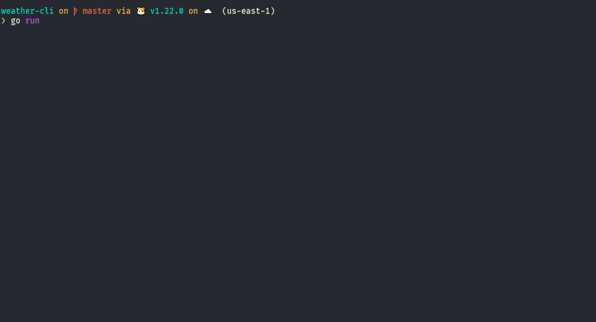

## Weather CLI
A simple CLI to get the weather forecast of a specific location.

### How to use
1. Go to https://www.weatherapi.com/, create an account and get an api-key
2. Put your api-key value in the file `.env` as `API_KEY=your-value`
3. Run using `go run .`

### Disclaimer

This project is created solely for educational purposes and personal learning. It is not intended for commercial use, and any commercial applications developed using this code should be approached with caution and proper legal consultation. The author(s) do not take any responsibility for any damages or liabilities incurred from the use of this code for commercial purposes. Please respect the original intentions of this project and use it responsibly.

Additionally, please note that the author(s) of this project are not the owners of all the dependencies used. While efforts have been made to ensure proper attribution and adherence to licenses, some dependencies may be subject to their own licenses and terms of use. Users are responsible for reviewing and complying with the licenses and terms of all dependencies used in this project.